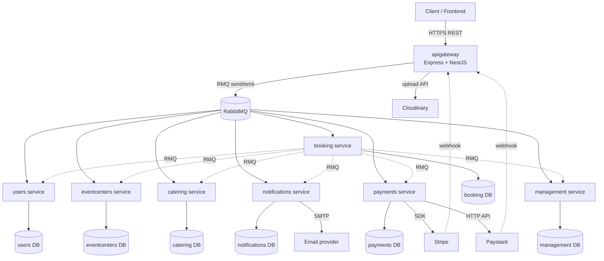

# BanquetPro API — Technical Documentation

This is the primary technical reference for the backend. Companion documents: `TECHNICAL_DEBT.md` (evidence-based debt inventory) and `KNOWN_GAPS.md` (feature-completeness gaps + prioritized takeover plan).

**Scope note:** this repository contains the backend only — a NestJS microservices monorepo. There is no frontend/UI code here; sections of the standard takeover template that only make sense for a frontend (component hierarchy, Tailwind, GraphQL client config, responsive/accessibility/SEO) are omitted.

---

## 1. Project Overview

**What the application does** *(confirmed from code)*: BanquetPro is a two-sided marketplace connecting customers with **event centers** and **catering services** provided by service providers. Customers can search/browse listings, request quotes, create bookings against specific timeslots, pay via Stripe or Paystack, and (per schema/partially-implemented code) leave reviews. Service providers manage their own listings, images, and refund policies, and are expected to be able to withdraw earned funds. Admins manage reference data (countries/states) and app-wide settings.

**User types** *(confirmed from `libs/contracts`)*: `ADMIN`, `SERVICE_PROVIDER`, `CUSTOMER`, `STAFF`.

**Major features present in code** *(confirmed)*:
- Account registration, email verification, login/refresh/logout, password reset, bookmarks.
- Event-center and catering-service listings with image upload (Cloudinary), search/filter.
- Booking creation, request-quote flow, timeslot management.
- Invoicing and payments (Stripe + Paystack), wallet crediting, escrow holding.
- Email notifications via SMTP.
- Admin-managed countries/states/app settings.

**Features present in schema/partial code but not reachable end-to-end** *(confirmed — see `KNOWN_GAPS.md`)*: refunds, withdrawals, reviews, refund policies per listing.

**Target users** *(inferred)*: event-center owners and caterers as supply-side service providers; individuals/organizations planning events as demand-side customers; an internal admin/ops team maintaining reference data.

---

## 2. Technology Stack

| Layer | Technology | Version (from `package.json`) |
|---|---|---|
| Framework | NestJS (monorepo mode) | `^10.0.0` core packages |
| Language | TypeScript | `^5.1.3` |
| HTTP entry point | Express (via `@nestjs/platform-express`) | `^10.0.0` |
| Inter-service transport | RabbitMQ via `@nestjs/microservices` (`Transport.RMQ`) | `amqplib ^0.10.5`, `amqp-connection-manager ^4.1.14` |
| ORM | Prisma — one client per microservice, one database per service | `^6.8.2` (CLI), `@prisma/client ^6.2.1` |
| Auth | Passport (`passport-jwt`), `bcrypt` for hashing | `passport ^0.7.0`, `passport-jwt ^4.0.1`, `bcrypt ^5.1.1` |
| Validation | `class-validator` / `class-transformer`, NestJS `ValidationPipe` | `^0.14.1` / `^0.5.1` |
| API docs | `@nestjs/swagger` + `swagger-ui-express` | `^11.0.6` |
| Caching | `@nestjs/cache-manager` (default in-memory store) | `^3.1.0` |
| Rate limiting | `@nestjs/throttler` — **installed, not used anywhere** (see `TECHNICAL_DEBT.md` N3) | `^6.3.0` |
| File storage | Cloudinary (image uploads) | `cloudinary ^2.6.1` |
| Payments | Stripe SDK + Paystack (via raw HTTP, no SDK found) | `stripe ^18.5.0` |
| Email | `nodemailer` / `@nestjs-modules/mailer` | `^6.10.0` / `^2.0.2` |
| Testing | Jest + Supertest (scaffolded but not meaningfully implemented — see `TECHNICAL_DEBT.md` §6) | `jest ^29.5.0` |
| Lint/format | ESLint 8 + Prettier 3 | `^8.42.0` / `^3.0.0` |
| Package manager | Yarn (confirmed via `yarn.lock` presence and every `Dockerfile`'s `yarn install --frozen-lockfile`) | — |
| Containerization | Docker (per-app multi-stage `Dockerfile`s) + Docker Compose | — |

No frontend framework, CSS framework, state management library, or GraphQL layer exists in this repository — this is a REST/RMQ backend only.

---

## 3. Repository Structure

```text
apps/
├── apigateway/        # The ONLY public HTTP entry point (Express/NestJS REST API)
│   ├── src/
│   │   ├── users/, eventcenters/, catering/, booking/, payment/, notifications/, management/
│   │   │   (each: controller + service that proxy to the matching microservice via ClientProxy.send()/.emit())
│   │   ├── jwt/        # JwtStrategy + 4 guards: JwtAuthGuard, VerificationGuard, AccountStatusGuard, AdminRoleGuard
│   │   ├── client-config/   # ClientConfigService — configures one RMQ ClientProxy per downstream microservice
│   │   ├── cloudinary/ # Image upload service
│   │   └── common/     # cache decorators/store, correlation-id middleware, HTTP logging interceptor
│   └── (no Prisma schema — the gateway has no direct database access)
├── users/              # Auth, user CRUD, verification, bookmarks — own Prisma schema/DB
├── eventcenters/       # Event-center listings + images — own Prisma schema/DB
├── catering/           # Catering service listings — own Prisma schema/DB
├── booking/            # Bookings, request-quotes, timeslots — own Prisma schema/DB
├── payments/           # Invoices, payments (Stripe/Paystack), wallet, refunds*, withdrawals* — own Prisma schema/DB
│                         (*refunds/withdrawals: implemented but unreachable — see KNOWN_GAPS.md GAP-014)
├── notifications/      # Email notifications, reviews* — own Prisma schema/DB
│                         (*reviews: implemented but unreachable — see KNOWN_GAPS.md GAP-015)
└── management/         # Admin-managed countries/states/app settings — own Prisma schema/DB

libs/
├── contracts/src/      # Shared DTOs, RMQ message-pattern constants, client injection tokens
│   └── Constants/constants.ts   # Client tokens (USER_CLIENT, EVENT_CENTER_CLIENT, etc.)
└── interfaces/src/     # Shared TypeScript interfaces

docker-compose.yml       # Local dev infra only: Postgres + RabbitMQ (no app containers)
docker-compose.prod.yml  # Production compose — currently wires only 3 of 8 app services (see below)
apps/*/Dockerfile        # One multi-stage Dockerfile per app, all exist
apps/*/.env, .env.staging # Per-service env files (loading has known inconsistencies — TECHNICAL_DEBT.md N4)
Jenkinsfile              # CI/CD: build + manual-gated per-service deploy to EC2 via PM2 (no test/lint stage)
Jenkinsfile copy         # Alternate/legacy pipeline: deploys to AWS ECS via Docker+ECR instead
jenkinsContainerized     # Alternate/legacy pipeline: builds Docker image on the EC2 host directly
```

Each `apps/<service>/` (microservices) additionally contains a `prisma/` directory with its own `schema.prisma` and generated client — there is no shared/central database; each service owns its data.

---

## 4. Application Architecture



**Key architectural facts** *(confirmed)*:
- `apigateway` is the single HTTP surface. All 7 other apps are RMQ-transport-only microservices with no public HTTP port (their `main.ts` calls `NestFactory.createMicroservice`, not `create`).
- Communication pattern: gateway controllers call `ClientProxy.send()` (request/response, awaits a reply) for queries, and `.emit()` (fire-and-forget) for one-way notifications. Queue names follow `${SERVICE}QUEUE_${NODE_ENV}` (see `ClientConfigService` in each app).
- `booking` is the most heavily cross-service-dependent microservice — it calls out to users, eventcenters, catering, notifications, payments, and management, all via its own `client-config` (`apps/booking/client-config/client-config.service.ts`).
- There is no API gateway-level circuit breaker, retry, or timeout on any of these RMQ calls (`TECHNICAL_DEBT.md` A5) — a slow/down microservice currently hangs the originating HTTP request indefinitely.
- Each microservice owns an independent Postgres database via its own Prisma schema — there is no shared database and no cross-service foreign keys; referential integrity across service boundaries (e.g. a booking referencing a `serviceProviderId` that lives in the users DB) is enforced only at the application level, not the database level.

---

## 5. Authentication & Authorization

**As designed** *(inferred from guard structure and naming)*: a request carries a JWT bearer access token; `JwtAuthGuard` validates it (via `passport-jwt`, delegating to `JwtStrategy`), `VerificationGuard` additionally requires `isEmailVerified`, `AccountStatusGuard` requires `status === 'ACTIVE'`, and `AdminRoleGuard` requires the resolved user to have a non-null `admin` relation. Guards are stacked per-route as needed (e.g. `@UseGuards(JwtAuthGuard, VerificationGuard)`).

**As implemented — CRITICAL DEVIATION, verified directly against source** (full trace in `TECHNICAL_DEBT.md` §0 and `KNOWN_GAPS.md` GAP-001/GAP-002):
- `JwtStrategy.validate()` (`apps/apigateway/src/jwt/jwt.strategy.ts:23-42`) calls `await this.userClient.send(...)`, but `.send()` returns an RxJS `Observable`, not a `Promise`. `await` on a non-thenable resolves immediately to the value itself — so `validate()` never actually waits for the microservice's response, and `request.user` ends up holding the raw, unsubscribed `Observable` object, not the resolved `UserDto`.
- **`AdminRoleGuard` is currently broken open**: `handleRequest` checks `user.admin !== null` with no prior null/err check. Since `user` is always the Observable (`undefined.admin` → `undefined`, and `undefined !== null` is `true`), **every admin-gated route currently authorizes any authenticated user as an admin.**
- **`VerificationGuard`/`AccountStatusGuard` are currently unreliable**: both read `request.user` before awaiting the passport flow that sets it, so `firstValueFrom(request.user)` is usually called on `undefined` and throws, 500-ing instead of enforcing verification/active-status.
- Downstream, ~30 controller call sites across the codebase do `await firstValueFrom(req.user)` to unwrap what they assume is an Observable — this only "works" because of the `jwt.strategy.ts` bug above, and **must be updated in lockstep with any fix** to that bug.

**Token lifecycle** *(confirmed from `libs/contracts` + project history)*: access token 59 minutes, refresh token 7 days, both issued at login and stored/validated against the `users` service.

**Known auth gaps beyond the guard bug** (see `TECHNICAL_DEBT.md` §4 for full list): no ownership checks on user-profile or listing mutation endpoints, password-reset tokens that never expire, soft-deleted accounts whose existing tokens keep working, and no rate limiting on any auth-adjacent endpoint.

**Roles/permissions**: enforced only via the guards above plus ad-hoc in-handler checks (`user.userType !== 'ADMIN'`) that are applied inconsistently even within the same controller (`TECHNICAL_DEBT.md` S-series and N7).

`BACKEND VERIFICATION REQUIRED` is not applicable here since this document *is* the backend; anything above marked "as designed" vs. "as implemented" should be treated as the source of truth for what a consuming frontend can currently rely on.

---

## 6. Service-to-Service Contracts (RMQ)

There is no external API gateway documentation beyond Swagger (`/api/docs` on the gateway, itself incomplete — see `TECHNICAL_DEBT.md` N6). Internally, each domain has a `*PATTERN` constant object in `libs/contracts/src/<domain>/` enumerating its RMQ message patterns (e.g. `USERPATTERN`, `BOOKINGPATTERN`, `EVENTCENTERREFUNDPOLICYPATTERN`). The gateway's per-domain service class (`apps/apigateway/src/<domain>/<domain>.service.ts`) is the only place that should call these patterns via its injected `ClientProxy`.

**Confirmed contract mismatches** (gateway calls a pattern with no live microservice handler — every one of these hangs until RMQ timeout):

| Pattern / feature | Gateway caller | Microservice handler status |
|---|---|---|
| Refunds (`create`/`approve`/`decline`/`findAll`/`findOne`/`update`) | `apps/apigateway/src/payment/payment.controller.ts:774-816` | Commented out — `apps/payments/src/payments.controller.ts:583-658` |
| Withdrawals | Gateway `WithdrawalController`/`WithdrawalGatewayService` | Commented out — `apps/payments/src/payments.controller.ts:806-853` |
| Notification CRUD (all except `SEND`) | `apps/apigateway/src/notifications/notifications.controller.ts` | Commented out — `apps/notifications/src/notifications.controller.ts:13-52` |
| Reviews (both ends) | Gateway `ReviewController` | Commented out on both sides despite a complete `ReviewService` existing at `apps/notifications/src/notifications.service.ts:323-486` |
| `EVENTCENTERREFUNDPOLICYPATTERN.UPSERT`/`FINDBYSERVICEID` | `eventcenters.service.ts:74-84`, `catering.service.ts:63-73` | Commented out on both domains |
| `TIMESLOTPATTERN.FINDONEBYID` | `apps/apigateway/src/booking/booking.controller.ts:685-688` | Commented out — `apps/booking/src/booking.controller.ts:241-255` |
| `BOOKINGPATTERN` cancel/reschedule/confirm | *(no gateway pattern exists — nothing to call)* | Service methods exist (`booking.service.ts:400,441,499`) but nothing routes to them |

Before adding a new gateway endpoint against an existing pattern name, **grep the target microservice controller to confirm the handler isn't commented out** — this codebase has several instances of that exact failure mode.

---

## 7. Major User Flows

### Registration → Verification → Login
```text
POST /users (register) → users service creates account, emits verification email
  ↓
Customer clicks emailed link → POST /users/verify → isEmailVerified = true
  ↓
POST /users/login → JwtStrategy resolves user → issues access + refresh token
  ↓
Subsequent requests: Authorization: Bearer <access token>
```
Status: registration and login work; the verification *enforcement* on other endpoints is unreliable due to the guard bug in §5.

### Booking a Service (Customer)
```text
GET /eventcenters or /catering (search/filter)
  ↓
GET /timeslot?serviceId=... (check availability — but see below)
  ↓
POST /booking (create) → booking service connects to requestedTimeSlots
  ↓  ⚠ no availability check performed here — see KNOWN_GAPS.md GAP-010
POST /payment/initiate → payments service returns a Stripe/Paystack checkout URL
  ↓
Customer pays on Stripe/Paystack → webhook fires → POST /payment/webhook
  ↓  ⚠ webhook is unsigned/unverified — see KNOWN_GAPS.md GAP-013
Booking payment status updated → confirmation notification (when notification payload shape matches — see GAP-017)
```
Status: **Broken** end-to-end from a production-safety standpoint — the two ⚠ points are P0 blockers (GAP-010, GAP-013), and cancelling a confirmed booking does not currently free its timeslot (GAP-011).

### Listing Management (Service Provider)
```text
POST /eventcenters or /catering (create) → validated (catering) or NOT validated (eventcenters, GAP-007)
  ↓
POST /eventcenters/:id or /catering/:id (image upload via Cloudinary)
  ↓
PATCH /eventcenters/:id or /catering/:id (update) → no ownership check (GAP-006)
  ↓
DELETE /:id (soft delete) → no ownership check (GAP-006), no Cloudinary asset cleanup
```
Status: **Broken** — any verified user can modify or delete any other provider's listing.

---

## 8. Environment Configuration

Variable names only — no values are reproduced here. See `.env.example` (generated alongside this document) for a fill-in-the-blanks template per service.

| Variable | Used by | Purpose |
|---|---|---|
| `NODE_ENV` | every app | Selects env file / suffixes RMQ queue names (`${QUEUE}_${NODE_ENV}`) |
| `DATABASE_URL` | every microservice (not the gateway) | Prisma connection string, one per service's own database |
| `USERSURL`, `USERSQUEUE` | gateway + every service that calls users | RabbitMQ URL + queue name for the users service |
| `EVENTSURL`, `EVENTSQUEUE` | gateway + booking, payments, catering | RMQ config for the eventcenters service |
| `CATERINGURL`, `CATERINGQUEUE` | gateway + booking, payments, eventcenters | RMQ config for the catering service |
| `BOOKINGURL`, `BOOKINGQUEUE` | gateway + notifications | RMQ config for the booking service |
| `PAYMENTURL`, `PAYMENTQUEUE` | gateway + users, booking | RMQ config for the payments service |
| `NOTIFICATIONURL`, `NOTIFICATIONQUEUE` | gateway + users, eventcenters, catering, booking, payments | RMQ config for the notifications service |
| `MANAGEMENTURL`, `MANAGEMENTQUEUE` | gateway + booking | RMQ config for the management service |
| `JWT_ACCESS_TOKEN_SECRET` | gateway (`jwt.strategy.ts`), users service | Signs/verifies access tokens |
| `JWT_REFRESH_TOKEN_SECRET` | users service | Signs/verifies refresh tokens |
| `JWT_EXPIRES_IN` | gateway, users service | Access token TTL |
| `FRONTEND_URL` | users service | Base URL embedded in password-reset/verification email links |
| `CLOUDINARY_CLOUD_NAME`, `CLOUDINARY_API_KEY`, `CLOUDINARY_API_SECRET` | gateway (`cloudinary.service.ts`) | Image upload credentials |
| `STRIPE_SECRET` | payments service (`stripe.payment.ts`) | Stripe SDK secret key |
| `PAYSTACK_SECRET_KEY` | payments service (`paystack.payment.ts`) | Paystack API secret key |
| `STRIPE_WEBHOOK_SECRET`, `PAYSTACK_WEBHOOK_SECRET` | **not currently referenced anywhere** | **Required to fix GAP-013 — must be added** |
| `INVOICE_VALID_NO_OF_DAYS` | payments service | Invoice expiry window |
| `REFUND_PROCESSING_DAY` | payments service | Refund processing schedule |
| `HOLD_PAYMENT_IN_ESCROW_WALLET` | payments service | Escrow behavior toggle |
| `SMTP_HOST`, `SMTP_PORT`, `SMTP_USER`, `SMTP_PASS` | notifications service | Outbound email transport |
| `POSTGRES_USER`, `POSTGRES_PASSWORD`, `POSTGRES_DB` | `docker-compose.yml`/`.prod.yml` | Local/prod Postgres container credentials |
| `RABBITMQ_USER`, `RABBITMQ_PASSWORD` | `docker-compose.yml`/`.prod.yml` | Local/prod RabbitMQ container credentials |

**Known configuration gaps** (`TECHNICAL_DEBT.md` N4/N5): no `ConfigModule` validation schema anywhere (a missing var silently becomes `undefined`), and `eventcenters`/`notifications`/`payments` modules load their env file from an inconsistent or wrong path (`eventcenters.module.ts` loads the *gateway's* `.env`; `notifications`/`payments` modules reference `'../env'`, missing the leading dot).

---

## 9. Local Development

Verified from `package.json` scripts and `docker-compose.yml` — commands are not invented.

**Prerequisites**: Node 20 (per every `Dockerfile`'s `FROM node:20-...`; not otherwise pinned via an `engines` field), Yarn (lockfile present), Docker (for Postgres + RabbitMQ).

```bash
# 1. Install dependencies (single root package.json for the whole monorepo)
yarn install

# 2. Start infra (Postgres + RabbitMQ only — no app containers)
docker-compose up -d

# 3. Populate each apps/<service>/.env — see section 8 above for the variable list
#    (each service needs its own DATABASE_URL, RMQ vars, and any service-specific secrets)

# 4. Generate/apply Prisma clients per service, e.g.:
yarn prisma generate --schema=apps/users/prisma/schema.prisma
yarn prisma migrate deploy --schema=apps/users/prisma/schema.prisma
# repeat per service that owns a schema (users, eventcenters, catering, booking, payments, notifications, management)

# 5. Start each app in its own terminal (no single "start everything" script exists today):
yarn start:dev              # apigateway
yarn start:users
yarn start:eventcenters
yarn start:catering
yarn start:booking
yarn start:payments
yarn start:notifications
yarn start:management

# Linting / formatting
yarn lint
yarn format

# Tests (currently not meaningfully passing — see TECHNICAL_DEBT.md §6)
yarn test
yarn test:e2e
yarn test:cov
```

There is currently no single command to bring up the full stack locally (`KNOWN_GAPS.md` D4) — this is a real onboarding friction point worth addressing (e.g. extending `docker-compose.yml` with all 8 app services, mirroring what `docker-compose.prod.yml` partially does).

---

## 10. Build & Deployment

**Build**: `nest build` per app (root `package.json` scripts `start:prod*` run `node dist/apps/<app>/main`).

**Containerization**: every app has its own multi-stage `Dockerfile` (builder stage installs deps + builds; runtime stage copies only `dist`, `node_modules`, `package.json`, `apps`). Confirmed present for all 8 apps.

**Production compose** (`docker-compose.prod.yml`) currently defines only **3 of the 8** app services: `apigateway`, `booking`, `eventcenters` (plus Postgres + RabbitMQ). `catering`, `users`, `payments`, `notifications`, `management` have working Dockerfiles but are **not included in this file** — as written, this compose file cannot bring up a functioning system, since `booking`/`eventcenters` depend on RMQ queues served by apps that never start. This must be reconciled before relying on `docker-compose.prod.yml` for an actual deployment (`KNOWN_GAPS.md` P2-1).

**CI/CD**: Jenkins, not GitHub Actions — no `.github/workflows`, but a root `Jenkinsfile` exists (`TECHNICAL_DEBT.md` D1, corrected from an earlier pass of this audit that only checked `.github/workflows` and wrongly reported no CI at all). The pipeline runs `yarn install` → `yarn build`, then a manual-approval-gated (`input()` step, 30-minute timeout) deploy stage per microservice, and posts the build result back to the GitHub commit status API. **It does not run `yarn test` or `yarn lint` at any stage** — a broken test (of which there are several — see §11) or a lint violation will not block a build or deploy.

Two additional pipeline files sit alongside it at the repo root — `Jenkinsfile copy` and `jenkinsContainerized` — describing materially different deployment targets:

| File | Deploy target | Mechanism |
|---|---|---|
| `Jenkinsfile` | EC2 (Hostinger-provisioned host) | `rsync`/`tar` the built `dist` + `node_modules` to the host over SSH, run under PM2 |
| `Jenkinsfile copy` | AWS ECS | Docker build → push to ECR → register a new ECS task definition → `aws ecs update-service` |
| `jenkinsContainerized` | EC2 | Docker image built directly on the EC2 host via SSH, run with `docker run` |

It is not evident from the repository alone which of these is the pipeline actually configured in the Jenkins server (a Jenkins multibranch/webhook job conventionally reads the file literally named `Jenkinsfile`, making it the likely active one, but this needs confirming against the Jenkins job configuration itself — `REQUIRES VERIFICATION`). Having three divergent, undocumented deployment strategies for the same set of services in the same repo is itself a source of confusion for anyone picking this up.

**Migrations**: Prisma migrations are run at container startup for at least the `booking` service (`CMD` in its `Dockerfile` runs `yarn prisma migrate deploy ... && yarn start:prodBooking`) — confirm this pattern is consistent across the other services' Dockerfiles before depending on it uniformly.

---

## 11. Testing

- **Framework**: Jest (`^29.5.0`) + `ts-jest`, Supertest for e2e. Config lives in root `package.json`'s `jest` block plus one `jest-e2e.json` per app.
- **Commands**: `yarn test`, `yarn test:watch`, `yarn test:cov`, `yarn test:e2e` (gateway only — other apps' e2e configs exist under `apps/*/test/jest-e2e.json` but would need `--config` pointed at them individually).
- **Current state**: 38 `.spec.ts` + 8 `.e2e-spec.ts` files exist repo-wide, but verified sampling across every domain found them to be either unedited NestJS CLI scaffolds (module-compiles assertion only, real test commented out) or actively broken against current source (e.g. `apps/management/src/management.controller.spec.ts` references classes that no longer exist; `apps/eventcenters/src/eventcenters.controller.spec.ts` would fail to even construct its `TestingModule`). **Do not trust the file count or a green `yarn test` run as a signal of real coverage** — see `TECHNICAL_DEBT.md` §6 for the specifics.
- **Missing critical-path coverage**: the auth guard chain (§5), the payment webhook (§6/GAP-013), booking creation/timeslot handling (GAP-010/011), and every ownership-check gap (GAP-006/016) have zero tests today.

---

## 12. Troubleshooting

Issues a developer picking this up is likely to hit, based on confirmed code behavior:

- **"Every request to an admin-only endpoint succeeds even without an admin account"** → this is GAP-001, not a local misconfiguration. See `TECHNICAL_DEBT.md` §0.1.
- **"Requests to a verified/active-only endpoint intermittently 500 with a `TypeError` about `subscribe`"** → this is GAP-002 (`firstValueFrom(undefined)`), not a flaky network issue.
- **"The eventcenters microservice can't find expected env vars"** → check `apps/eventcenters/src/eventcenters.module.ts:17`; it currently points at the gateway's `.env` file, not its own.
- **"`?country=` on the catering search endpoint always 500s"** → GAP-005; the field doesn't exist in the Prisma schema.
- **"A webhook test payload from Stripe/Paystack gets processed with no way to verify it came from them"** → expected today; GAP-013 has not been fixed yet. Do not treat this as production-ready.
- **"`docker-compose -f docker-compose.prod.yml up` doesn't fully work"** → only 3 of 8 services are defined in that file; see §10.
- **"A cancelled booking's timeslot still shows as unavailable"** → GAP-011; the cancel path is currently unreachable from the gateway.
- **RMQ queue redeclaration error (`PRECONDITION_FAILED`) on startup** → check whether the queue's `durable` flag changed; it's inconsistent per service today (`TECHNICAL_DEBT.md` A2) and RabbitMQ refuses to redeclare an existing queue with a different durability setting.

---

## 13. Production Readiness

```markdown
### Critical (P0 — do not launch without these)
- [ ] Fix JwtStrategy Observable-await bug (GAP-001 root cause)
- [ ] Fix AdminRoleGuard authorization bypass (GAP-001)
- [ ] Fix VerificationGuard/AccountStatusGuard race condition (GAP-002)
- [ ] Guard + add ownership checks to GET/PATCH /users/:id (GAP-016)
- [ ] Add ownership checks to listing update/delete (GAP-006)
- [ ] Add Stripe/Paystack webhook signature verification (GAP-013)
- [ ] Prevent double-booking at the database/transaction level (GAP-010)
- [ ] Wire up booking cancel/reschedule/confirm + timeslot release (GAP-011)

### High Priority (P1)
- [ ] Fix refreshlogin request body binding (GAP-003)
- [ ] Enforce password-reset token expiry (GAP-004)
- [ ] Fix catering `country` filter / query-param validation (GAP-005)
- [ ] Type event-center `create` body as a real DTO (GAP-007)
- [ ] Constrain booking status transitions (GAP-012)
- [ ] Fix notification payload shape mismatch for payment/subscription alerts (GAP-017)
- [ ] Decide and implement (or explicitly cut) refunds/withdrawals (GAP-014)
- [ ] Reconcile docker-compose.prod.yml to cover all 8 services
- [ ] Fix per-service .env path inconsistencies

### Medium Priority (P2)
- [ ] Add env var validation schema (fail fast on missing config)
- [ ] Reconcile RMQ durable/noAck settings across services
- [ ] Add ClientProxy timeout/retry policy
- [ ] Resolve or remove dead refund-policy / review / notification-CRUD endpoints
- [ ] Add rate limiting (wire up the already-installed @nestjs/throttler)
- [ ] Add Helmet + request body size limits at the gateway
- [ ] Move gateway cache to a shared store (Redis) before scaling horizontally
- [ ] Add health-check endpoints (@nestjs/terminus) to all apps
- [ ] Replace scaffold-only test files with real assertions for the P0/P1 areas above

### Optional / Technical Debt (P3)
- [ ] Enable strictNullChecks/noImplicitAny in tsconfig.json (large migration, high long-term value)
- [ ] Remove duplicated booking createV1/create endpoints
- [ ] Remove confirmed dead code (e.g. unconstrained deleteAll in eventcenters service)
- [ ] Plan NestJS 10→11 and ESLint 8→9 upgrades
- [ ] Update Swagger metadata and add addBearerAuth()
```

---

*This document, `TECHNICAL_DEBT.md`, and `KNOWN_GAPS.md` were produced via a full read-through of the repository (all 8 apps, shared `libs/contracts`, root config, Docker/CI setup) on 2026-09-06, including direct verification of the most severe findings against live source rather than relying on inference alone. Anything not explicitly marked "confirmed" above should be treated as inferred and re-checked against current code before being relied upon, since this snapshot will age as the code changes.*
