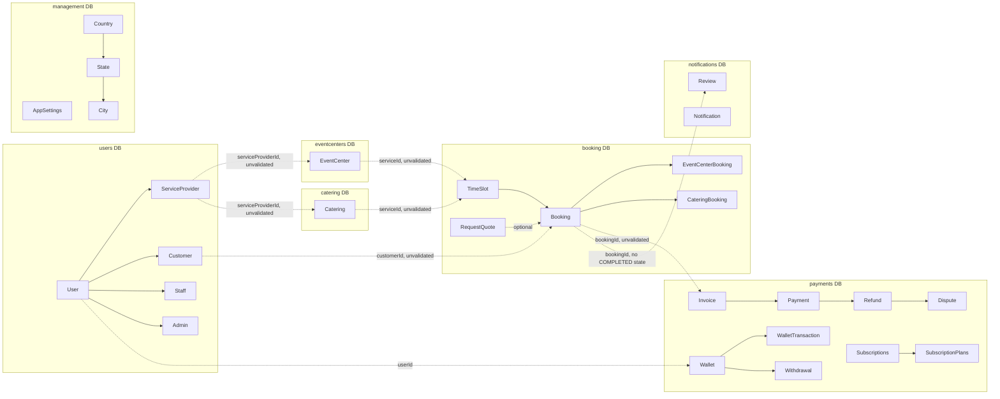

# Data Model

Seven independent Postgres databases, one per microservice, each with its own `apps/<service>/prisma/schema.prisma`. There is **no shared database and no cross-service foreign key** — every cross-service reference below is a plain string column, validated (per [`../planning/backend-gaps.md`](../planning/backend-gaps.md) `PM-GAP-043`) at write time in almost no cases that were traced.

## Cross-service reference map

Dashed edges = application-level-only reference (no DB constraint possible, and in the annotated cases, no runtime validation either).

## Per-service entity summary

| Service | Database | Core entities |
|---|---|---|
| `users` | users | `User`, `Admin`, `ServiceProvider`, `Customer`, `Staff`, `PersonalAccessTokens`, `Permission` *(dead)*, `KYCVerification` *(unwired)*, `Subscription`/`SubscriptionPlan`/`Featured` *(dead — see duplication below)* |
| `eventcenters` | eventcenters | `EventCenter`, `RefundPolicy`, `RefundPolicyTier` |
| `catering` | catering | `Catering`, `Menu`, `RefundPolicy`, `RefundPolicyTier` |
| `booking` | booking | `Booking`, `RequestQuote`, `TimeSlot`, `EventCenterBooking`, `CateringBooking`, `AvailableLocations` |
| `payments` | payments | `Payment`, `Invoice`, `Refund`, `Dispute`, `Wallet`, `WalletTransaction`, `Withdrawal`, `Subscriptions`/`SubscriptionPlans`/`FeaturedPlans` *(live)*, `Fees` |
| `notifications` | notifications | `Notification`, `Review` |
| `management` | management | `AppSettings`, `AppSettingLogs`, `Country`, `State`, `City` |

Full field-level detail per entity: [`../domain/overview.md`](../domain/overview.md).

## Confirmed schema duplications

These are the same concept, modeled independently more than once, with no shared source of truth:

| Concept | Duplicated in | Which is live | Evidence |
|---|---|---|---|
| `ServiceType` (EVENTCENTER/CATERING category tag) | `booking`, `payments`, `notifications`, `users` *(as `EVENTCENTERS`, plural — inconsistent)*, `libs/contracts/src/shared.ts` | All 5 are read somewhere — this is a live consistency risk, not just clutter | fork-mgmt-arch: 21 files reference these literals |
| Subscription / SubscriptionPlan / Featured | `users` schema **and** `payments` schema | `payments` — confirmed via the working `SubscriptionExpiryService` cron | fork-users, fork-payments |
| `ServiceStatus` / `SubscriptionStatus` enum bodies | `eventcenters` **and** `catering` schemas, byte-for-byte identical | Both — independently maintained copies | fork-catalog |
| `RefundPolicy` / `RefundPolicyTier` model | `eventcenters` **and** `catering` schemas, byte-for-byte identical | Neither reachable (GAP-008) | fork-catalog |
| `BookingStatus` enum | `booking` schema **and** `eventcenters` schema, independently defined with different values | `booking`'s is the one actually used in the booking lifecycle; `eventcenters`' copy (`{SCHEDULED, POSTPONED, CANCELED}`) is unused dead code | fork-booking, fork-catalog |
| Cancellation policy | `RefundPolicy`/`RefundPolicyTier` model (structured, dead) **vs.** `EventCenter.cancellationPolicy`/`Catering.cancellationPolicy` (free text, live) | The free-text field is what's actually read; the structured model is unreachable | fork-catalog |

Each of these is an ADR candidate in [`../planning/open-decisions.md`](../planning/open-decisions.md) — the fix is a product/architecture decision (delete the dead copy? centralize as a shared contract type?), not a mechanical merge.

## Money field type audit

Every money-bearing field in the codebase uses Prisma `Decimal` **except one**: `Catering.startPrice: Float`. Every other price/amount/balance field (`EventCenter.pricingPerSlot`, all of `payments` schema, `Booking.total`) is `Decimal(10,2)` or `Decimal(12,2)`. `Catering.startPrice` is a real float-precision risk on a "quote-based, dynamic pricing" service and should be migrated to `Decimal` — flagged for the technical-debt backlog, not a live bug today only because `startPrice` itself doesn't appear to be read in any money-math code path traced so far (it functions as catalog/marketing display data; confirm before relying on this).

## Migrations

Not audited in Phase A at the migration-history level (which migrations exist, whether `migrate deploy` is run consistently across environments). Flagged for Phase B / `docs/data/migrations.md`.
